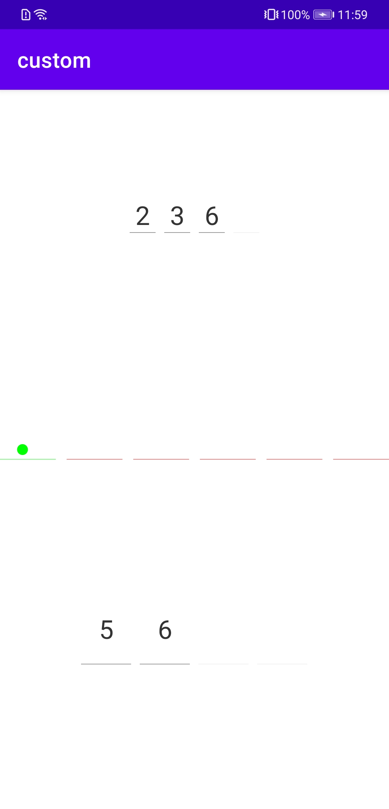

##### :verifyview

验证码输入控件

可设置底部横向间距，颜色。验证码字体大小，文字颜色，验证码长度等。

效果图：




自定义属性：

```xml
<declare-styleable name="VerifyView">
        <attr name="verifyLength" format="integer"/>
        <attr name="verifyTextSize" format="dimension"/>
        <attr name="verifyTextColor" format="color"/>
        <attr name="verifySolidCircleSize" format="dimension"/>
        <attr name="verifyStrokeGap" format="dimension"/>
        <attr name="verifyStrokeHeight" format="dimension"/>
        <attr name="verifyStrokeColorNotInput" format="color"/>
        <attr name="verifyStrokeColorFilled" format="color"/>
    </declare-styleable>
```


